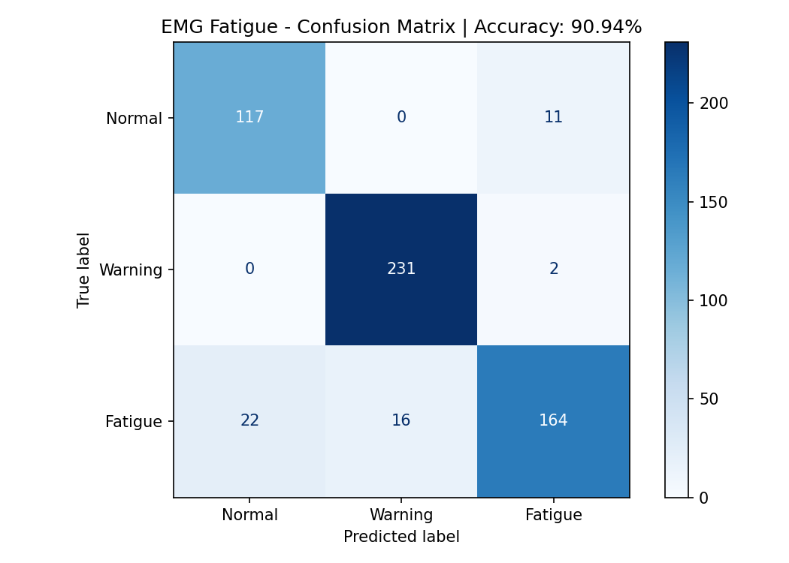
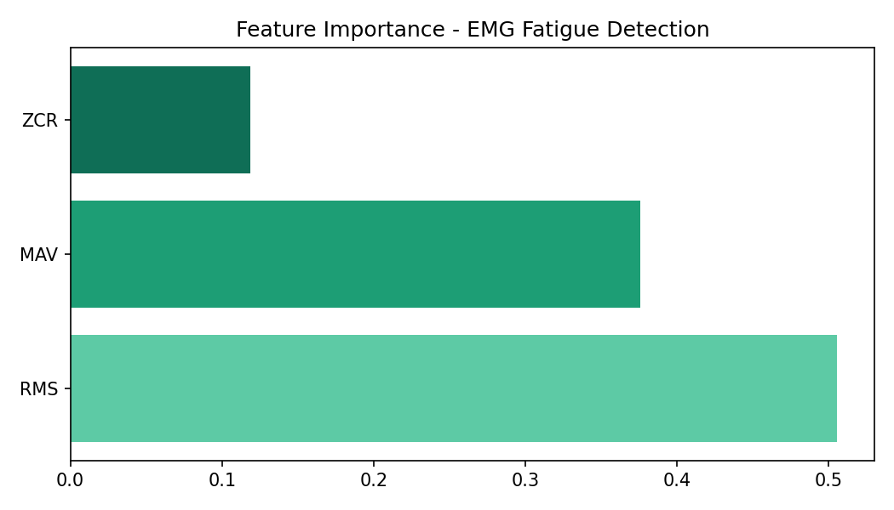

# EMG-Muscle-Fatigue-Detection
Real-time EMG-based muscle fatigue detection using Arduino and Machine Learning
# 💪 EMG-Based Muscle Fatigue Detection System

> Real-time muscle fatigue detection using surface EMG signals, Arduino, and Machine Learning (Random Forest Classifier)


---

## 📌 Project Overview

This project detects **three levels of muscle fatigue** in real time using surface EMG (Electromyography) signals captured via an EMG sensor connected to an Arduino Uno. The acquired signals are processed using feature extraction techniques and classified using a **Random Forest machine learning model** trained on data collected from **4 subjects**.

The system is designed for applications in:
- Sports performance monitoring
- Rehabilitation and physiotherapy
- Workplace ergonomics and injury prevention
- Wearable health technology

---

## 🎯 Fatigue Levels Detected

| Level | Label | Description |
|-------|-------|-------------|
| 0 | **Normal** | Muscle at rest or minimal activity |
| 1 | **Warning** | Early signs of fatigue detected |
| 2 | **Fatigue** | Critical fatigue — rest recommended |

---

## 🔧 Hardware Used

| Component | Details |
|-----------|---------|
| Microcontroller | Arduino Uno |
| EMG Sensor | MyoWare / AD8232 compatible |
| Display | OLED SSD1306 (128x64, I2C) |
| Power | USB / 5V |

---

## 🧠 System Architecture

```
EMG Sensor (Muscle)
       ↓
Arduino Uno (Signal Acquisition)
       ↓
Feature Extraction: RMS, MAV, ZCR
       ↓
Random Forest Classifier (Python / Edge Impulse)
       ↓
Fatigue Level Output: Normal / Warning / Fatigue
       ↓
OLED Display + Serial Monitor
```

---

## 📊 Features Extracted

| Feature | Full Name | Role |
|---------|-----------|------|
| **RMS** | Root Mean Square | Primary fatigue indicator (50% importance) |
| **MAV** | Mean Absolute Value | Signal amplitude measure (38% importance) |
| **ZCR** | Zero Crossing Rate | Frequency-domain proxy (12% importance) |

---

## 🤖 Machine Learning Results

- **Algorithm:** Random Forest Classifier (100 trees, max depth 10)
- **Dataset:** 2,814 samples from 4 subjects
- **Train/Test Split:** 80% / 20%

### ✅ Accuracy: 90.94%

| Class | Precision | Recall | F1-Score |
|-------|-----------|--------|----------|
| Normal (0) | 0.84 | 0.91 | 0.88 |
| Warning (1) | 0.94 | 0.99 | 0.96 |
| Fatigue (2) | 0.93 | 0.81 | 0.87 |
| **Overall** | **0.91** | **0.91** | **0.91** |

> 5-Fold Cross-Validation Accuracy: **81.45% ± 11.18%**

### Confusion Matrix


### Feature Importance


---

## 📁 Repository Structure

```
EMG-Muscle-Fatigue-Detection/
│
├── emg_ml.py                  # ML training pipeline (Random Forest)
├── emg_combined_clean.xlsx    # Cleaned dataset (4 subjects, 2814 rows)
├── emg_model.pkl              # Trained ML model
├── confusion_matrix.png       # Model evaluation graph
├── feature_importance.png     # Feature importance graph
└── README.md                  # Project documentation
```

---

## 🚀 How to Run the ML Pipeline

### 1. Install dependencies
```bash
py -m pip install pandas numpy scikit-learn matplotlib seaborn openpyxl
```

### 2. Clone the repository
```bash
git clone https://github.com/YOUR_USERNAME/EMG-Muscle-Fatigue-Detection.git
cd EMG-Muscle-Fatigue-Detection
```

### 3. Run the ML script
```bash
py emg_ml.py
```

### Output
- Accuracy and classification report printed in terminal
- `confusion_matrix.png` saved
- `feature_importance.png` saved
- `emg_model.pkl` saved (trained model)

---

## 📡 Arduino Setup

1. Connect EMG sensor output to **A0** pin on Arduino Uno
2. Connect OLED display via **I2C (SDA→A4, SCL→A5)**
3. Install libraries in Arduino IDE:
   - `Adafruit_GFX`
   - `Adafruit_SSD1306`
4. Upload the Arduino sketch
5. Open Serial Monitor at **9600 baud**
6. Follow on-screen calibration (Rest → 50% Flex → Max Flex)
7. EMG data streams as CSV: `Time, RMS, MAV, ZCR, MDF, Level`

---

## 👥 Data Collection

| Subject | Samples | Quality |
|---------|---------|---------|
| Person 1 | 203 | ✅ Clean |
| Person 2 | 1720 | ✅ Cleaned (10 artifacts removed) |
| Person 3 | 238 | ✅ Cleaned (58 noise rows removed) |
| Person 4 | 653 | ✅ Excellent |
| **Total** | **2814** | **Ready for ML** |

---

## 🔮 Future Work

- [ ] Deploy ML model to Arduino using **Edge Impulse (TinyML)**
- [ ] Bluetooth / WiFi wireless data transmission
- [ ] Mobile app for real-time fatigue alerts
- [ ] Expand dataset to more subjects for better generalization
- [ ] Add more EMG features (Waveform Length, Slope Sign Changes)

---

## 📄 License

This project is licensed under the MIT License.

---

## 🙏 Acknowledgements

- Adafruit for SSD1306 OLED library
- Scikit-learn for ML framework
- Edge Impulse for TinyML deployment platform

---

*Developed as part of an Engineering Project — EMG Muscle Fatigue Detection System*
